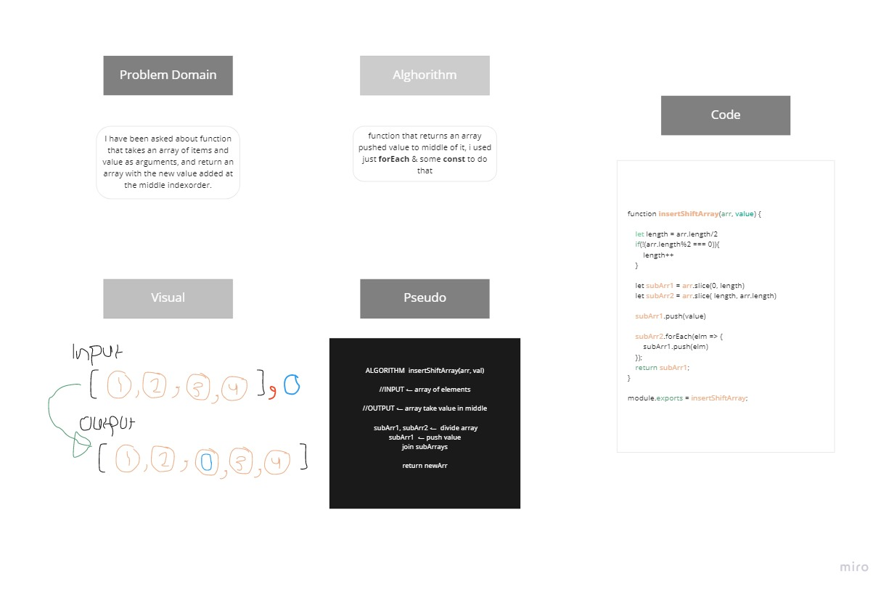

# Challenge Summary

 return an array with the new value added at the middle index.

## Challenge Description
```
Write a function called insertShiftArray which takes in an array and the value to be added. Without utilizing any of the built-in methods available to your language, return an array with the new value added at the middle index.

```

## Approach & Efficiency

Logical thinking & solving step by step 

## Solution



